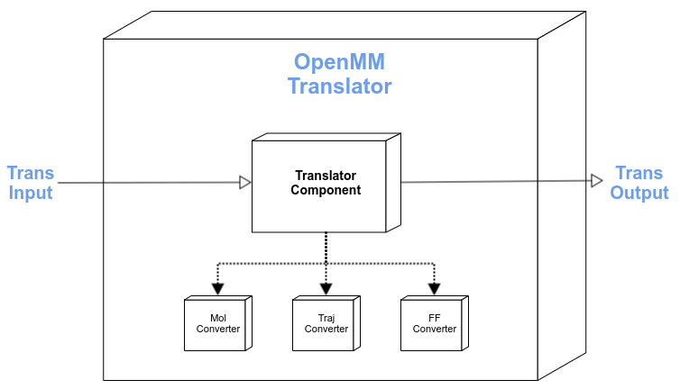

[//]: # (Badges)
[](https://github.com/MolSSI/mmic_openmm/actions?query=workflow%3ACI)
[](https://codecov.io/gh/MolSSI/mmic_openmm/branch/master)
[](https://lgtm.com/projects/g/MolSSI/mmic_openmm/context:python)

OpenMM translator for MMSchema
==============================
This is part of the [MolSSI](http://molssi.org) Molecular Mechanics Interoperable Components ([MMIC](https://github.com/MolSSI/mmic)) project. This package provides translators between [MMSchema](https://molssi.github.io/mmschema) and [OpenMM](https://github.com/openmm/openmm).



# API
**mmic_openmm** provides 3 classes of translators for: molecules (topology), trajectories, and forcefields.

## Models
```python
from mmic_openmm.models import OpenMMMol

# Convert MMSchema to OpenMM topology
pa_mol = OpenMMMol.from_schema(mm_mol) -> 

# Convert OpenMM topology to MMSchema molecule
mm_mol = OpenMMMol.to_schema(pa_mol) -> mmelemental.models.molecule.Molecule

```
One could do similar conversions for the `ForceField` model as well.

## Components
The `from_schema` and `to_schema` methods in the `OpenMMMol` model use translation components provided by **mmic_openmm** and **MMElemental** to convert between MMSchema and OpenMM.

```python
from mmic_openmm.components import OpenMMToMolComponent, MolToOpenMMComponent
from mmic_openmm.models.import OpenMMMol
from mmelemental.models.molecule import Molecule
```

### MMSchema to OpenMM molecule
```python
# Create MMSchema molecule
mm_mol = Molecule.from_file(path_to_file)

# Create translation input
inp = {
    "schema_object": mm_mol,
    "schema_version": 1,
}

# Run translator compute
outp = MolToOpenMMComponent.compute(inp)

# Extract OpenMM topology object
top = outp.data_object.data
```

### OpenMM to MMSchema molecule
```python
from simtk.openmm import app

# Create OpenMM input
top = app.PDBFile(path_to_file)
ommol = mmic_openmm.models.OpenMMMol(mol=top)

# Create translation input
inp = {
    "data_object": ommol
}

# Running translator compute
outp = Translator.compute(inp)

# Extract MMSchema molecule
mm_mol = outp.schema_object
```
One could do similar conversions with the force field component as well.

### Copyright
Copyright (c) 2021, MolSSI


#### Acknowledgements
 
Project based on the 
[Computational Molecular Science Python Cookiecutter](https://github.com/molssi/cookiecutter-cms) version 1.5.
